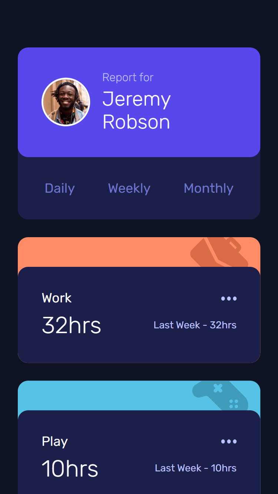
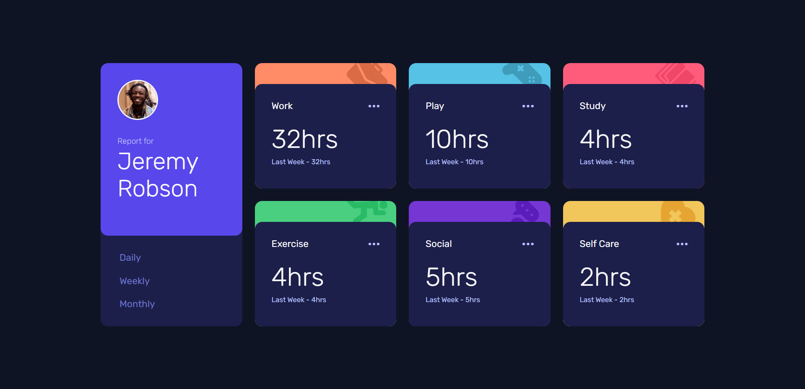

# Frontend Mentor - Time tracking dashboard solution

This is a proposed solution to the [Time tracking dashboard challenge on Frontend Mentor](https://www.frontendmentor.io/challenges/time-tracking-dashboard-UIQ7167Jw).

## Table of contents

- [Overview](#overview)
  - [The challenge](#the-challenge)
  - [Screenshots](#screenshots)
  - [Links](#links)
- [My process](#my-process)
  - [Built with](#built-with)
  - [What I learned](#what-i-learned)
  - [Useful resources](#useful-resources)
- [Author](#author)

## Overview

### The challenge

Users should be able to:

- View the optimal layout for the site depending on their device's screen size
- See hover states for all interactive elements on the page
- Switch between viewing Daily, Weekly, and Monthly stats

### Screenshots

| Mobile                            | Desktop                             |
| --------------------------------- | ----------------------------------- |
|  |  |

### Links

- Solution URL: [Solution submitted in Frontend Mentor](https://www.frontendmentor.io/solutions/dashboard-tracking-using-flexbox-grid-and-react-5pguTPTIo5)
- Live Site URL: [Dashboard Tracking](https://tcotd-dashboard-tracker-fm.netlify.app/)

## My process

### Built with

- Semantic HTML5 markup
- CSS3 custom properties
- Flexbox
- CSS Grid
- Mobile-first workflow
- [React](https://reactjs.org/) - JS library
- [Vite](https://vitejs.dev/) - Build tool

### What I learned

This project was a way to continue reinforcing my knowledge in React, as well as an opportunity to deepen in the use of custom hooks in order to make the components as clean as possible.

As for the styles, I used the BEM nomenclature along with ITCSS guidelines so that the organization of my styles was not complicated. In the same way, I added prefixes to the CSS classes to categorize them within the ITCSS to make it easier to recognize which CSS class to use. Combining with BEM, I think it is a very useful approach to write CSS classes if you're not using any CSS framework since you get a good overall specificity.

```css
.c-card {
  /* Component block called card */
}

.c-card__body {
  /* Element 'body' of the card component */
}
```

I want to recall the use of CSS layers to get a better final organization in the code.

### Useful resources

- [CSS Layers](https://css-tricks.com/css-cascade-layers/) - This helped me to make a better organization in my CSS code. I would use it again if I'm not working with a CSS framework.
- [BEM](https://getbem.com/) - This nomenclature would be very useful for you if you're working on CSS. It will help you to write a better maintainable styles code.

## Author

- Frontend Mentor - [@sebas-tcotd](https://www.frontendmentor.io/profile/sebas-tcotd)
- Twitter - [@sebas_tcotd](https://twitter.com/sebas_tcotd)

<hr />

<div style="text-align: center; font-family: monospace; font-size: 10px">||S||</div>
